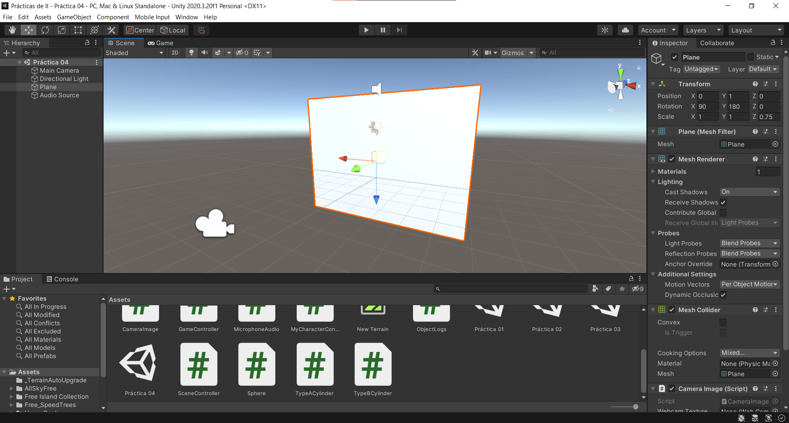
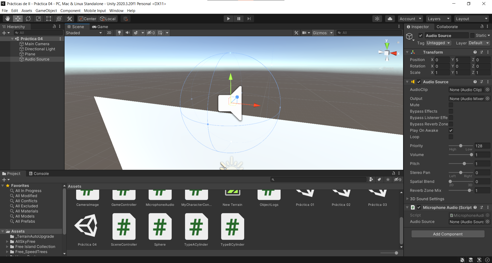
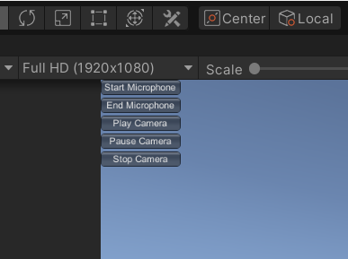

# Práctica 3

Para esta práctica se ha implementado la obtención en tiempo real de imagenes a través de la cámara y de audio a través del microfono usando las clases WebCamTexture y Microphone respectivamente.

En el caso de la cámara se ha creado un plano vertical al cual se le ha añadido el siguiente script que se enarga de obtener constantemente el flujo de datos de la cámara por defecto y lo establece como textura en dicho plano, lo que crea la sensación de que lo que se está viendo es una pantalla que replica la imagen obtenida.

```cs
public class CameraImage : MonoBehaviour {
  public WebCamTexture webcamTexture;

  void Start() {
    SceneController.OnClickPlayCamEvent += OnClickPlayCam;
    SceneController.OnClickPauseCamEvent += OnClickPauseCam;
    SceneController.OnClickStopCamEvent += OnClickStopCam;
    webcamTexture = new WebCamTexture();
    Renderer renderer = GetComponent<Renderer>();
    renderer.material.mainTexture = webcamTexture;
    webcamTexture.Play();
  }

  void Update() {}

  void OnClickPlayCam() {
    if (!webcamTexture.isPlaying) {
      webcamTexture.Play();
    }
  }

  void OnClickPauseCam() {
    if (webcamTexture.isPlaying) {
      webcamTexture.Pause();
    }
  }

  void OnClickStopCam() {
    if (webcamTexture.isPlaying) {
      webcamTexture.Stop();
    }
  }

  void OnDisable() {
    SceneController.OnClickPlayCamEvent -= OnClickPlayCam;
    SceneController.OnClickPauseCamEvent -= OnClickPauseCam;
    SceneController.OnClickStopCamEvent -= OnClickStopCam;
  }
}
```



Para el microfono se ha introducido sobre la imagen de la cámara, para mantener cierta concordancia en relación a la ubicación espacial, un elemento de tipo "Audio Source", al que, de forma similar al anterior, se le ha añadido su script correspondiente que se encarga de obtener el flujo de datos proveniente del microfono y reproducirlos una vez terminada la grabación.

```cs
public class MicrophoneAudio : MonoBehaviour {
  public AudioSource audioSource;

  void Start() {
    SceneController.OnClickStartMicEvent += OnClickStartMic;
    SceneController.OnClickEndMicEvent += OnClickEndMic;
    audioSource = GetComponent<AudioSource>();
    audioSource.clip = Microphone.Start("", true, 10, 44100);
  }

  void Update() {}

  void OnClickStartMic() {
    if (!Microphone.IsRecording("")) {
      audioSource.clip = Microphone.Start("", true, 10, 44100);
    }
  }

  void OnClickEndMic() {
    if (Microphone.IsRecording("")) {
      Microphone.End("");
      audioSource.Play();
    }
  }

  void OnDisable() {
    SceneController.OnClickStartMicEvent += OnClickStartMic;
    SceneController.OnClickEndMicEvent += OnClickEndMic;
  }
}
```



Por último se ha añadido una interfaz gráfica de usuario dedicada al control de la parada y la reanudación de los flujos de datos para conseguir la abstracción de dicho control mediante delegados y eventos.

```cs
public class SceneController : MonoBehaviour {
  public delegate void OnClickDelegate();
  public static event OnClickDelegate OnClickStartMicEvent, OnClickEndMicEvent;
  public static event OnClickDelegate OnClickPlayCamEvent, OnClickPauseCamEvent;
  public static event OnClickDelegate OnClickStopCamEvent;

  // ...

  void OnGUI() {
    if (GUILayout.Button("Start Microphone")) {
      OnClickStartMicEvent();
    }
    if (GUILayout.Button("End Microphone")) {
      OnClickEndMicEvent();
    }
    if (GUILayout.Button("Play Camera")) {
      OnClickPlayCamEvent();
    }
    if (GUILayout.Button("Pause Camera")) {
      OnClickPauseCamEvent();
    }
    if (GUILayout.Button("Stop Camera")) {
      OnClickStopCamEvent();
    }
  }
}
```


